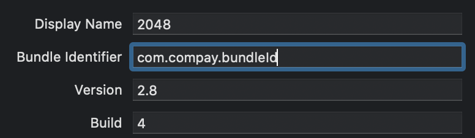

# CelerX iOS Game Demo: 2048

This is a demo repo for CelerX native iOS game SDK for an example 2048 game.

## Download Necessary Depedencies

-- Debug

```shell
sh downloadLibs.sh
```

-- Release

```shell
sh downloadReleaseLibs.sh
```

It will download all the required dependencies for CelerGameSDK

## Project setup for compiling

- Embed everything from the dependencies folder

- Change `Celersdk.framework` to `Do not embed`

- Disable bitcode(Due to one of the embeded library, might change in the future)

- Add Your Resource Bundle(For cover arts etc)
- Add Your GoogleService-Info.plist(Push Notification)

- Register your BundleId with our portal


- Add necessary permissions

## Prerequisites

--

- Necessary Assets
[assets file](grphicAssetsIntegration.pdf)

- Push Certificates

## Permissions

Permission | Reason
------------ | -------------
Location | Required by law when play real money game
Microphone | Used by Instabug
Album | Allow user to upload profile pictures
iCloud | Back up user wallet
keychain group | ban potential cheaters
Apple pay | payment
Push notification | message
Camera | Allow user to upload profile pictures
Bluetooth Peripherals | requiredfrom a payment vendor
Universal Link | Promotions

--
Camera, Alnum and Bluetooth Peripherals are required for appstore submission, Location is required for real money games

## Integrate with our sdk

### Import Framework

```objc
#import <CelerGameSdk/CelerGameSdk.h>
```

### Init SDK

```objc
[CelerGame initializeSdk];
```

--
Try not to call this function at app's start or start of your first view, do this  when you have passed your initial loading screen, and preferably being trigger by user action, delay one runloop if you'll have to present sdk UI at launch

### Register Celer Game SDK Life Cycle

```objc
[CelerGame setSdkDelegate:self];
```

### CelerSdkDelegate

```objc
- (void)matchSeedGenerated:(double)seed

- (void)onMatchJoin:(nonnull id)gameObject

- (void)onReady

- (void)onResult
```

matchSeedGenerated
----

This callback provides a double type seed in order to generate a random level fair to the players, seed will range from 0 ~ 1

onMatchJoin:gameObject
----

This callback provides necessary infomation about the match in a json package, display info as fit

gameObject
----

For Objective C, gameObject will be a dictionary formatted as below：

```json
{
   "matchId":"01b085ed-b928-4476-a6ff-924c18fbf0d8",
   "players":[
      {
         "id":"sand.siesta",
         "index":1,
         "name":""
      },
      {
         "id":"pear.penury",
         "index":2,
         "name":""
      }
   ],
   "sharedRandomSeed":0.99951094382847394,
   "shouldLaunchTutorial":true,
   "difficultyLevel":1,
   "currentPlayer":{
      "id":"pear.penury",
      "index":0,
      "name":""
   }
}
```

onReady
----

Start your game here

onResult
----

Do some clean up work

### CelerGameSdk method

```objc
[[CelerGame shared] sendWithCallback:CelerGameStateOnLoaded];

[[CelerGame shared] sendWithCommand:CelerGameCommandHideInterface];

[[CelerGame shared] sendWithCommand:CelerGameCommandShowInterface];

[[CelerGame shared] submitWithScore:_score];
```

sendWithCallback:CelerGameStateOnLoaded
-

call this function when game level has finished loading

sendWithCommand:CelerGameCommandHideInterface
-

hide CelerGameSDK UI

sendWithCommand:CelerGameCommandShowInterface
-

show CelerGameSDK UI

submitWithScore:int
-

submit Score

## Notes

- To run this demo, run download script in the root directory
- An universal framework that supports simulator and devices will be provided, it will run on a debug environment
- A release framework only supports devices will be provided for appstore, it will run on release configuration
- For a pure OC project target before ios 12.2, please enable `Always Embed Swift Standard Libraries` settings [https://stackoverflow.com/questions/55364816/with-swift-5-and-ios-12-2-should-i-change-always-embed-swift-standard-librarie]
- Minimuim sdk requirement is iOS 11
